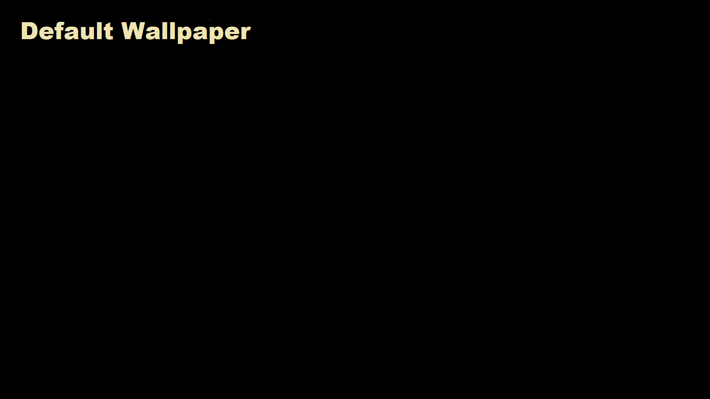
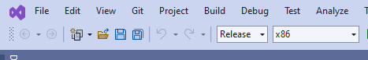
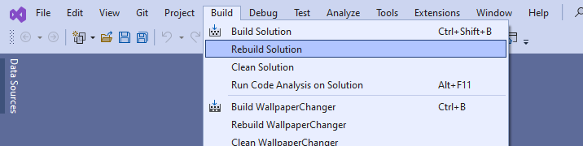

# capture-monitor-to-desktop

This is a [PowerShell](https://learn.microsoft.com/en-us/powershell/scripting/overview?view=powershell-7.3) script to capture the contents a windows display monitor directly to the desktop wallpaper.

It requires *WallpaperChanger.exe* (from https://github.com/philhansen/WallpaperChanger)

`WallpaperChanger.exe` is included in this repo, but you might prefer to build it yourself, indeed, depending on you windows security settings, you may need to do that before you can run the `WallpaperChanger.exe` file, or [tell windows to allow it to run](https://github.com/jonathan-annett/capture-monitor-to-desktop/blob/main/README.md#asking-windows-security-to-bless-a-downloaded-file) (or you might elect to do both - compile it yourself, and then tell windows to allow it to run)

AutoHotKey script
===

how you invoke the powershell script is up to you, but if you happen to have [AutoHotKey](https://www.autohotkey.com/) installed on your computer, included is a script (capture.ahk) which will assign hotkeys to allow you to invoke the powershell script without exiting the current application.

The keys (which you can change by editing the script) are as follows:

ctrl-shift-F1 captures display 1

ctrl-shift-F2 captures display 2 

ctrl-shift-F3 captures display 3 (if you have one) 

ctrl-shift-F4 captures display 4 (if you have one) 

ctrl-shift-F11 sets the wallpaper to "default.png"

   - you can either update the default.png to your liking
   - or edit the script to specify an existing file)

   
ctrl-shift-F12 sets the wallpaper to a random picture from [Lorem Picsum](https://picsum.photos/) 

   - needs internet
      
      
      
But Why?
---
The relatively niche application of this script is for audio visual operators who wish to change the desktop of their computer to reflect a "holding slide" from a currently running powerpoint presentation.

Typically the operator would do this at the start of a session involving multiple presentations, choosing a slide that might be appropriate to use a as a "holding slide".

Since it's not always known ahead of time what that slide should be, this mechanism allows the operator to nominate that slide "on the fly" without interupting a running presentation.

Another reason you might do this is so you can exit powerpoint completely, leaving the extended desktop showing the current slide.

This allows the operator to open another file, or do something else without disturbing what's being displayed on the projection screen.

Building the WallpaperChanger.exe file
---

Information on how to do this is covered at [learn.microsoft.com](https://learn.microsoft.com/en-us/visualstudio/ide/building-and-cleaning-projects-and-solutions-in-visual-studio?view=vs-2022), however...

You'll need [Microsoft's Visual Studio](https://visualstudio.microsoft.com/vs/community/) installed (the free community version is fine)

Next you'll need to download the github project either by downloading the zipfile directly from [github](https://github.com/philhansen/WallpaperChanger/archive/refs/heads/master.zip) using your browser, or you may prefer to clone the repository using whatever tools you are familiar with, from `https://github.com/philhansen/WallpaperChanger.git`

Once you have extracted the files onto your hard drive (or have cloned the repo), you can go ahead and double click on the `WallpaperChanger.sln` file, to open it in Visual Studio.

If you are prompted to install additional tools, you'll need to do this before continuing, it's usually just a matter of clicking an "install" button.

To build the project, first change the Target Selection dropdown from "Debug" to "Release" as shown below

This simply tells Visual Studio to make the file as efficient as possible, and not include extra code that would allow you to debug it using Visual Studio.

To actually build the file use the menu in visual studio to select "Rebuild Solutuion" from the "Build" menu:

The compiled file will be in .\WallpaperChanger\bin\Release, and you will neeed to copy it to the same folder as the capture scripts.

Asking Windows Security to "bless" a downloaded file
---

If you need help on how to do this, visit [support.microsoft.com](https://support.microsoft.com/en-us/windows/add-an-exclusion-to-windows-security-811816c0-4dfd-af4a-47e4-c301afe13b26) for more information.

